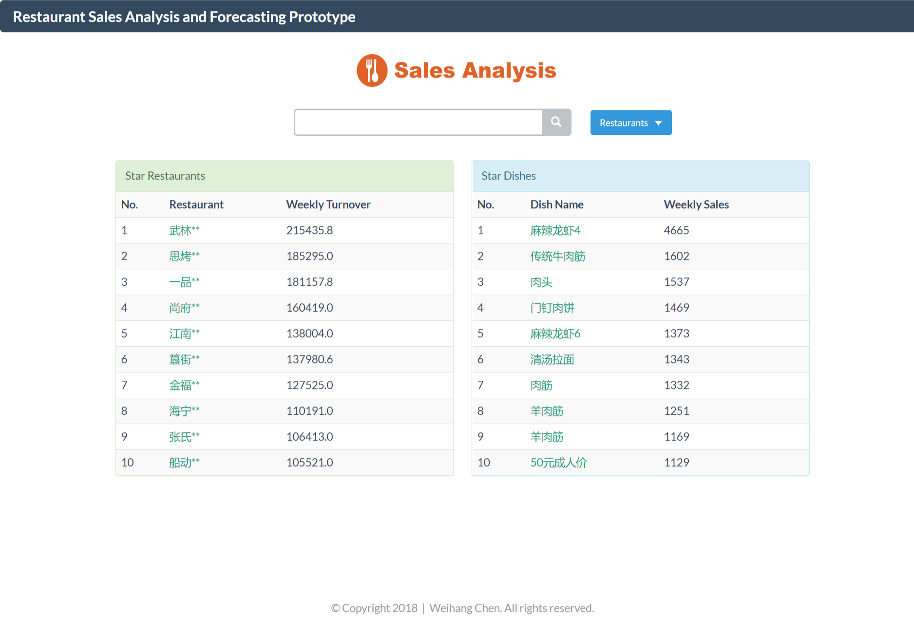
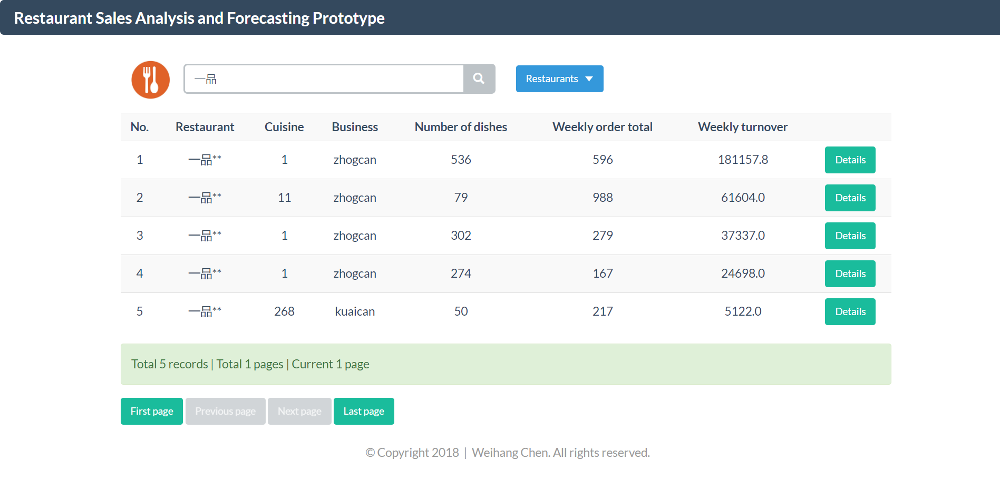
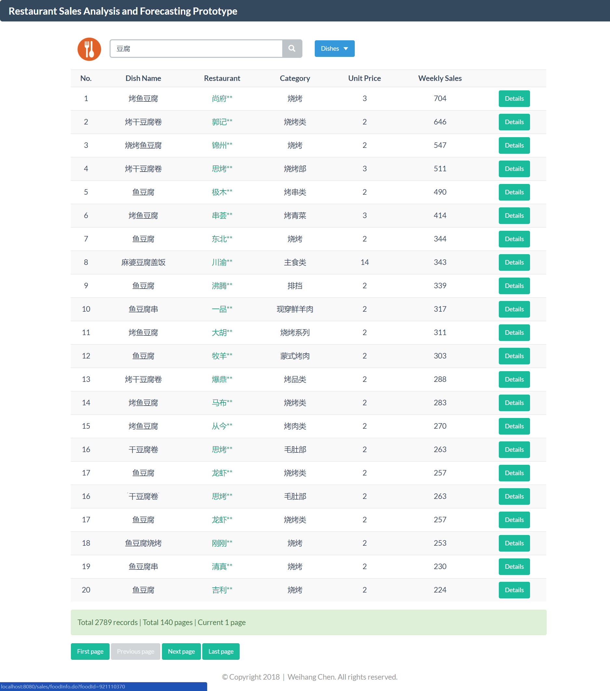
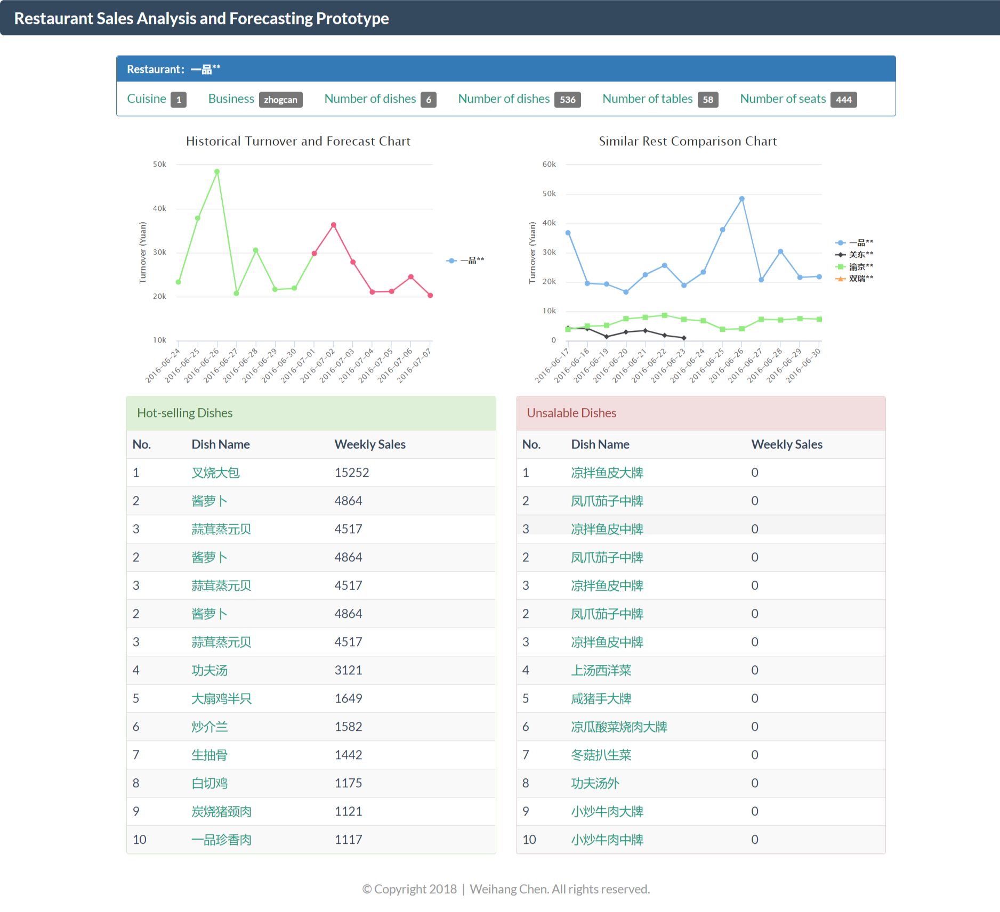
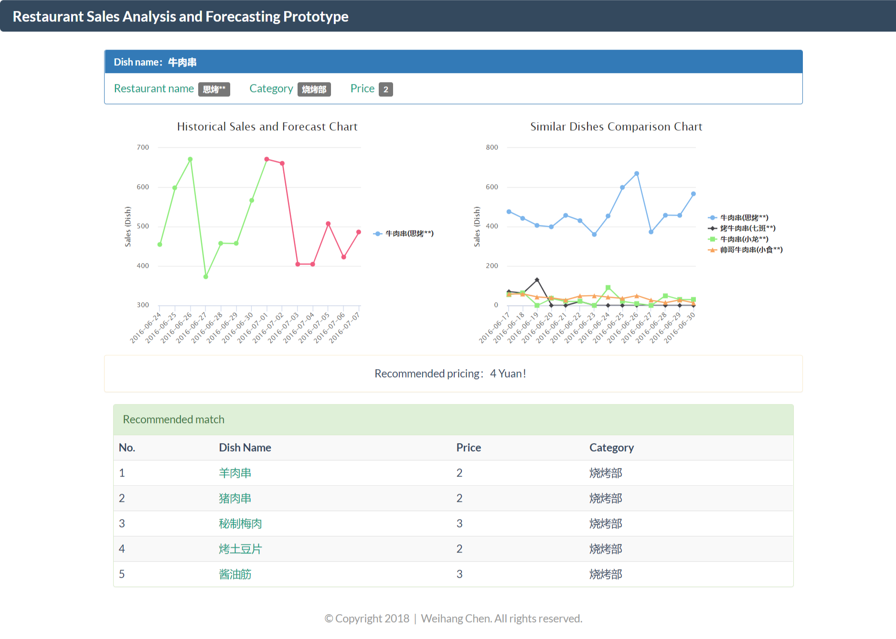

# RestSalesForecast

Restaurant sales analysis and forecast

## 1. 选题背景

本次比赛，我选择了17个Global Goals中的第12个主题，负责任的消费和生产。

现如今科技发展十分迅速，近几年来人工智能技术在社会生活中的应用也越来越广泛。人工智能创新将成为实现联合国可持续发展目标（SDG）的核心，并有助于解决人类面临的巨大挑战。

例如，机器学习和推理可以通过自动诊断和有效利用有限的医疗专业知识和运输资源（SDG3）将医疗保健扩展到偏远地区，人工智能还将成为遏制城市环境温室气体排放和支持智慧城市发展的关键资源（可持续发展目标11和13），而全球伙伴关系（可持续发展目标17）将为我们实现所有这些目标提供重要支持。

对于第12个可持续发展目标，重点在于确保可持续的消费和生产模式。在该领域，目前人工智能正在通过垂直绿色农场产生最佳消费和生产水平，消除浪费并大大提高产量和资源效率。

而本项目原型是想要通过对餐厅经营过程中积累的数据进行分析建模，实现短期的消费预测，从而帮助餐厅合理备货，减少库存浪费。

这与以下两个子目标契合：
12.3 - 减少全球人均食物浪费
12.5 - 大幅减少废物生产

通过销售分析和预测，一方面餐厅能够更加合理地售卖客人喜欢的菜品，减少不必要的浪费，另一方面也能从源头上优化餐饮供给与生产配比。

## 2. 项目原型说明

### 2.1 目录结构说明

- analysis: 数据分析与预测的实现代码
- visual: 数据可视化代码
- demo: 暂存的网页样例（供环境配置前预览）
- war: 用于发布网站的war包

### 2.2 网站运行环境说明

本原型通过网站展示数据分析与预测结果。

#### 软件开发环境

- Java JDK1.8.0_144
- apache-tomcat-8.5.6  
- SQL Server 2008 R2  
- IntelliJ IDEA  

#### 代码运行说明  

1. 请安装SQLServer2008R2，将数据库还原，由于数据库备份文件较大，所以请到百度云盘下载  
  链接：https://pan.baidu.com/s/1V70U7rXemMcrF-5zvKG4Ag 密码：j9tc
2. 请安装相应的JDK、部署tomcat，安装IDEA，配置工程运行，注意修改数据库配置文件中的用户名与密码  
3. 或者直接将war目录下的rest-sales-analysis.war放到tomcat的webapps目录下，启动tomcat即可通过http://localhost:8080/rest-sales-analysis访问网站，注意也需要修改数据库配置文件  

### 2.3 数据分析预测代码说明

#### 编程语言及运行环境  

- Python  

#### 目录说明  

- data目录存放原始数据
- 生成result目录存放预测结果

## 代码运行说明
sudo pip install numpy  
sudo sudo apt-get install python-matplotlib ipython ipython-notebook  
sudo apt-get install python-pandas python-sympy python-nose  
sudo pip install scipy  
sudo pip install scikit-learn 

python proc.py  

- 聚类和回归算法调用了sklearn.  
- spark版本使用了mllib

## 3. 网站设计介绍

### 3.1 模型介绍

#### (1) 餐厅营业额预测
首先用k-means聚类算法对1000家餐厅按营业额进行聚类，得到5个不同营业额水平的餐厅簇。然后选用菜系，业态，菜品类别，餐厅特征（餐台数、座位数、员工数），每日销售特征（订单数、客流量、人均消费）等特征，使用Spark MLlib提供的线性回归和回归树算法分别针对每一个簇进行训练建模，然后再进行预测。

#### (2) 菜品销量预测
将时间特征（周、节假日），餐厅特征（餐厅类别），菜品特征（单价，销售排行），菜品历史销售特征（订单数）等作为Spark MLlib提供的线性回归和回归树算法进行训练建模的输入，训练好模型后进行预测。

#### (3) 菜品关联规则挖掘
啤酒和尿布的故事说明同一订单内的商品存在某种关联，那么同一订单中的菜品之间也存在着一定的关联。使用Apriori算法进行关联规则的挖掘，把一家餐厅的所有订单信息作为算法输入，输出的结果就是订单中出现的次数比较高的菜品组合，可以为餐厅推出新套餐提供参考意见。

### 3.2 功能说明

这里对项目中的关键功能进行范围限定和功能说明。

(1) 明星餐厅：近一周内平台上所有餐厅营业额排名前10的餐厅  
(2) 明星菜品：近一周内平台上所有菜品销量排名前10的菜品  
(3) 相似餐厅：选取菜系，业态，餐桌数，座位数，菜品数量等特征，给每一个特征一个权值，求两个餐厅加权的余弦相似度，当相似度大于0.8，就认为两个餐厅比较相似，取最相似的几个餐厅进行比较  
(4) 热销菜品：近一个月一家餐厅销量前10的菜品  
(5) 滞销菜品：近一个月一家餐厅销量后10的菜品  
(6) 同类菜品：名字相同或者相近的菜品被看做相似菜品  
(7) 推荐定价：获得同类菜品销量前10的菜品，用销量作为权值，进行加权平均  
(8) 推荐搭配：Apriori算法从订单信息中挖掘出的出现次数较高的菜品搭配组合  

### 3.2 页面展示

#### 主页

#### 餐厅搜索结果

#### 菜品搜素结果

#### 餐厅信息

#### 菜品信息

