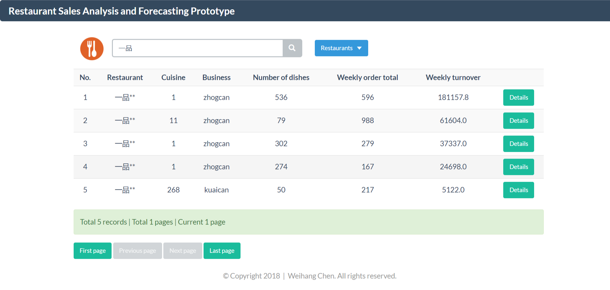
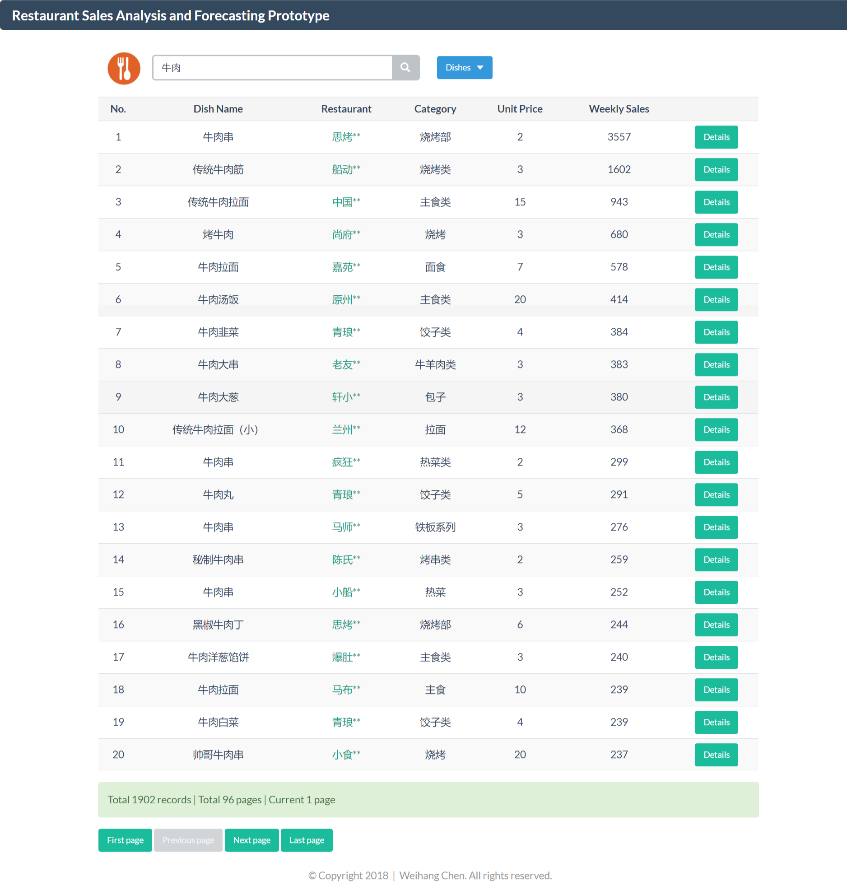
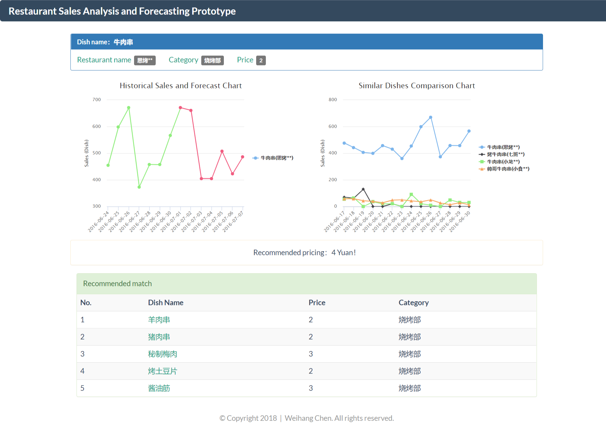

# RestSalesForecast

Restaurant sales analysis and forecast

## 1. Theme background

In this competition, I chose the 12th theme in 17 Global Goals, responsible consumption and production.

Nowadays, the development of science and technology is very rapid. In recent years, the application of artificial intelligence technology in social life has become more and more extensive. Artificial intelligence innovation will be at the heart of achieving the United Nations Sustainable Development Goals (SDGs) and will help solve the enormous challenges facing humanity.

For example, machine learning and reasoning can extend health care to remote areas through automated diagnosis and effective use of limited medical expertise and transportation resources (SDG3), which will also be key to curbing urban environmental greenhouse gas emissions and supporting smart city development. Resources (Sustainable Development Goals 11 and 13), and the Global Partnership (Sustainable Development Goal 17) will provide important support for us to achieve all of these goals.

For the 12th Sustainable Development Goals, the focus is on ensuring sustainable consumption and production patterns. In this area, artificial intelligence is currently producing optimal consumption and production levels through vertical green farms, eliminating waste and greatly increasing production and resource efficiency.

The prototype of this project is to realize the short-term consumption forecast by analyzing and modeling the data accumulated in the restaurant operation process, thus helping the restaurant to properly stock up and reduce the waste of inventory.

This fits into the following two sub-goals:
12.3 - Reduce global food waste per capita
12.5 - Significantly reduce waste production

Through sales analysis and forecasting, on the one hand, the restaurant can more reasonably sell the dishes that guests like, reduce unnecessary waste, and on the other hand, optimize the supply of food and production from the source.

## 2. Project Prototype Description

### 2.1 Directory Structure Description

- analysis: implementation code for data analysis and prediction
- visual: data visualization code
- demo: Sample temporary webpage (preview before environment configuration)
- war: war package for publishing websites

### 2.2 Website Operating Environment Description

This prototype demonstrates data analysis and forecasting results through a website.

#### Software Development Environment

- Java JDK1.8.0_144  
- apache-tomcat-8.5.6  
- SQL Server 2008 R2  
- IntelliJ IDEA  

#### Code Run Description

1. Please install SQLServer2008R2, restore the database, because the database backup file is large, so please go to Baidu cloud disk to download
  Link: https://pan.baidu.com/s/1V70U7rXemMcrF-5zvKG4Ag Password: j9tc
2. Please install the corresponding JDK, deploy tomcat, install IDEA, configure the project to run, pay attention to modify the user name and password in the database configuration file.
3. Or directly put the rest-sales-analysis.war in the war directory to the webapps directory of tomcat. Start tomcat and access the website through http://localhost:8080/rest-sales-analysis. Note that you also need to modify the database. Configuration file

### 2.3 Data Analysis Forecast Code Description

#### Programming language and operating environment

- Python

#### Catalog Description

- data directory to store raw data
- Generate result directory to store forecast results

#### Code Run Description
Sudo pip install numpy
Sudo sudo apt-get install python-matplotlib ipython ipython-notebook
Sudo apt-get install python-pandas python-sympy python-nose
Sudo pip install scipy
Sudo pip install scikit-learn

Python proc.py

- Clustering and regression algorithms call sklearn.
- spark version uses mllib

## 3. Introduction to website design

### 3.1 Model Introduction

#### (1) Restaurant turnover forecast
Firstly, the k-means clustering algorithm was used to cluster 1000 restaurants according to the turnover, and five restaurant clusters with different turnover levels were obtained. Then use the characteristics of cuisine, business, food category, restaurant characteristics (number of meals, number of seats, number of employees), daily sales characteristics (orders, traffic, per capita consumption), using linear regression and regression tree algorithm provided by Spark MLlib Training is modeled separately for each cluster and then predicted.

#### (2) Vegetable sales forecast
Time characteristics (weeks, holidays), restaurant characteristics (restaurant category), dish characteristics (unit price, sales ranking), menu historical sales characteristics (order number), etc. as a linear regression and regression tree algorithm provided by Spark MLlib for training modeling Input, predict the model after training the model.

#### (3) Cooking association rules mining
The story of beer and diapers indicates that there is a certain association between the goods in the same order, so there is also a certain correlation between the dishes in the same order. The Apriori algorithm is used to mine the association rules. All the order information of a restaurant is input as an algorithm. The output result is a combination of dishes that appear in the order, which can provide a reference for the restaurant to launch a new package.

### 3.2 Function Description

Here, the scope and function description of the key functions in the project.

(1) Star Restaurant: Top 10 restaurants with all restaurant turnover on the platform in the past week  
(2) Star dishes: the top 10 dishes in all food sales on the platform in the past week  
(3) Similar restaurants: select the characteristics of cuisine, format, number of tables, number of seats, number of dishes, etc., give each feature a weight, and find the cosine similarity of the two restaurants. When the similarity is greater than 0.8, two The restaurants are similar, take the most similar restaurants for comparison  
(4) Hot-selling dishes: the top 10 dishes sold in a restaurant in the past month  
(5) Unsalable dishes: 10 dishes sold in a restaurant in the past month  
(6) Similar dishes: dishes with the same name or similar names are treated as similar dishes.  
(7) Recommended pricing: obtain the top 10 dishes of the same type of food, use the sales volume as the weight, and perform the weighted average  
(8) Recommended match: Apriori algorithm digs out the order information from the order of the dish  

### 3.2 Page display

#### Home

#### Restaurant Search Results

#### Vegetable Search Results

#### Restaurant Information

#### Dishes information

